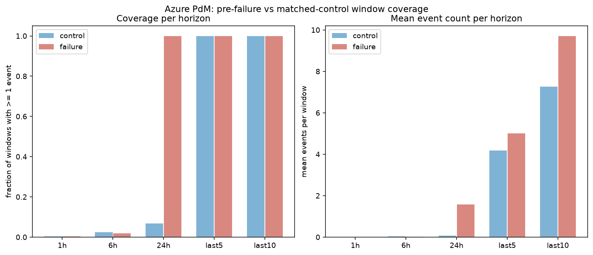
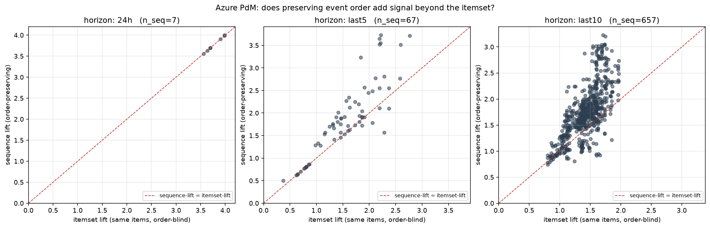
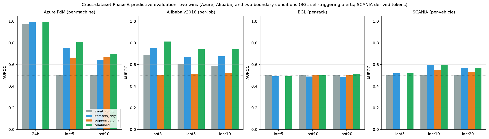

::: {.affiliations}
^1^ School of Computer Science, Faculty of Sciences, Holon Institute of Technology (HIT), Holon, Israel\
^2^ Intelligent Systems, Afeka Academic College of Engineering, Tel-Aviv, Israel
:::

## Abstract

Every large system logs discrete operational events: errors, retries,
task failures, maintenance actions. Frequent-pattern mining
(FP-Growth, PrefixSpan) surfaces recurrent gapped patterns in these
logs. We test whether pattern mining recovers physical-cascade
precursor signatures on real industrial telemetry when the underlying
process cascades through discrete stages. The result is a signature
catalog mined from six operational traces: two independent wind-farm
alarm logs (Kelmarsh 6 × Senvion MM92, 482 forced outages over
2016-2017; Penmanshiel 9 × Senvion MM82, 790 forced outages in 2016),
Azure PdM (synthetic), Alibaba v2018 (production cloud), LLNL Blue
Gene/L syslogs (HPC), and SCANIA Component X (production automotive).
Every signature is validated on an entity-disjoint 50/50 discovery/
inference split, with post-selection-valid p-values (Fithian-Sun-
Taylor) and Benjamini-Yekutieli FDR control on the inference half. A
count-preserving order comparator removes the multiplicity confound,
and the right-censored SCANIA trace is scored by matched conditional
logistic regression stratified by risk set (Prentice-Breslow). The central result is a replicated physical
cascade: on **two independent Senvion wind farms of different rotor
size and site, discovery/inference mining surfaces zero-control
cascade signatures of the same form at inference-half lift 4.0**
(generator-fan overload codes on Kelmarsh, safety-system and
frequency-converter codes on Penmanshiel). Azure
PdM and Alibaba v2018 reproduce the effect in cloud and maintenance
logs, with ordering adding no signal on Alibaba once event
multiplicity is controlled. SCANIA Component X, right-censored,
yields interpretable per-truck hazard ratios under matched
conditional logistic regression (108 of 200 top patterns survive the
arbitrary-dependence FDR; top HR 1.73). BGL is the mapped boundary
case where no non-alert precursor survives. Mining code, splits,
matched-hazard outputs, and per-dataset signature tables are released
as reproducible parquet artefacts.

**Keywords:** failure prediction; frequent itemset mining; sequential
pattern mining; post-selection inference; false discovery rate;
predictive maintenance; operational event logs.

## 1  Introduction

Operational logs from datacenters, industrial fleets, and cloud
platforms carry a rich stream of discrete events: software errors,
task failures, retries, eviction notices, maintenance actions,
component replacements. These events are usually consumed one at a
time by alerting systems and dashboards. We ask a different question:
do *recurrent ordered sequences* of these events precede failures
systematically enough to serve as early-warning signatures?

Two mining families answer this shape of question. Frequent itemset
mining (Apriori, FP-Growth) treats each pre-failure window as an
unordered set of events. Sequential pattern mining (PrefixSpan,
SPADE, GSP) preserves temporal order. One methodological question
runs through the paper: does the second family find anything the
first does not? Its central deliverable is a catalog of validated
pre-failure signatures, anchored by a physical cascade replicated
across two independent wind farms.

We contribute:

1. A **matched-control frequent-pattern pipeline that separates
   predictive patterns from frequent noise**, with sanity invariants
   at every phase (random-label permutation for itemsets, within-
   window order shuffle for sequences), exact hypergeometric
   permutation p-values, and BH FDR correction on the per-pattern
   significance test. The predictive-vs-noise separation is the
   central object we characterise, not a downstream AUROC number.
2. A **generalisation of matched-control mining to right-censored
   survival-style data via incidence-density (risk-set) sampling**
   with Mantel-Haenszel odds-ratio scoring, which estimates per-
   pattern hazard ratios without modifying the mining stage. This is
   the tool that lets the pipeline apply to traces where entities
   exit observation upon failure (Component X).
3. A downstream **predictive evaluation** on a temporally-held-out
   split that compares four feature sets (event-count baseline,
   itemsets, sequences, combined) built from patterns that survived
   training-set significance, under logistic regression.
4. **Cross-dataset characterisation** on six public traces: two
   production wind farms (Kelmarsh, Penmanshiel), synthetic
   industrial per-machine (Azure PdM), real cloud per-job (Alibaba
   cluster-trace-v2018), real HPC per-rack (LLNL Blue Gene/L
   syslogs), and real automotive per-vehicle (SCANIA Component X). We
   report the fraction of mined patterns that pass significance on
   each trace, the strongest predictive signatures, and the
   mechanistic reason why the fraction varies from ~85% (Azure last5
   sequences) to 0% (BGL) to 6% (SCANIA risk-set matched,
   BY-corrected).
5. A **validated signature catalog anchored by a replicated physical
   cascade**: two independent Senvion wind farms (Kelmarsh,
   Penmanshiel) produce zero-control cascade signatures at
   inference-half lift 4.0 under one mining protocol (§6.4), the
   closest the study comes to a controlled cross-site replication.

## 2  Background and related work

### 2.1 Frequent itemset and sequential pattern mining

The two mining families this paper compares are well-established.
Association-rule mining introduced Apriori [@agrawal1994fast] and
FP-Growth [@han2000mining] over unordered transactions, the latter
avoiding candidate generation through a compressed frequent-pattern
tree. Sequential pattern mining extended this to ordered event
streams: GSP [@srikant1996gsp] generalises Apriori-style level-wise
generation to sequences; SPADE [@zaki2001spade] uses a vertical
id-list format; PrefixSpan [@pei2001prefixspan] uses prefix-projected
pattern growth, and is the algorithm we use in this paper.

Later variants sharpen the raw output. CM-SPAM / CM-SPADE
[@fournierviger2014cmspade] speed vertical mining through co-occurrence
pruning; VMSP [@fournierviger2014vmsp] returns only maximal sequences,
compressing the pattern set without losing coverage. A recent survey
[@fournierviger2022patternmining] summarises open problems in the
area. All of these algorithms are implemented in the SPMF library
[@fournier2016spmf], which we call from Python for the sequence-mining
half of our pipeline; the itemset half uses `mlxtend`
[@raschka2018mlxtend].

### 2.2 Failure prediction from operational event logs

Two families of methods dominate the literature: (i) explicit
frequent-pattern mining on parsed log templates, close to what this
paper does, and (ii) deep learning over log sequences.

**Pattern mining.** Ren et al. [@ren2020failure] apply Spark FP-Growth
to failure prediction on BlueGene/L, LANL-HPC, and CMRI-Hadoop logs,
using event-density sliding windows over long-tail event vocabularies.
İfraz and Ersöz [@ifraz2024sequential] run PrefixSpan and Apriori
side-by-side on a bus-fleet maintenance log, showing that sequence
mining recovers "errors → replacement" trajectories that itemset
mining misses. Both studies stop short of the post-selection-valid
matched-control + BY-corrected + predictive-utility comparison used
here, and neither touches Alibaba PdM or Azure.

**Industrial alarm-flood mining and wind-turbine alarm logs.** The
process-control community mines alarm sequences directly. Hu, Wang
and Wang [@hu2023priority] mine priority-aware closed sequential
patterns to compress alarm floods into compact patterns; Hu et al.
[@hu2023frequent] adapt PrefixSpan to tolerate the short-term order
ambiguity of alarm timestamps. These methods are descriptive, keyed
to frequency and compactness rather than a validated pre-failure
claim; our count-preserving order comparator (§4.7) is the principled
test of exactly the order-vs-multiplicity ambiguity they handle
heuristically, and our matched controls turn each mined pattern into
an FDR-tested predictive hypothesis. On wind-turbine alarm logs
specifically, Chatterjee and Dethlefs [@chatterjee2022deep] predict
repair actions with a bi-LSTM over turbine alarm sequences, and Shah
and Tan [@shah2025alarm] forecast future turbine alarms with LSTM
regression. Both are black-box and forecast the alarm stream itself;
we mine auditable pre-failure signatures on the same class of Senvion
SCADA logs (Kelmarsh, Penmanshiel) with FDR guarantees and zero
control-window false alarms.

**Discriminative and statistically-significant pattern mining.** Dong
and Li [@dong1999emerging] introduced emerging patterns as itemsets
whose support differs substantially between classes; Bay and Pazzani
[@bay1999contrast] formulated the parallel notion of contrast sets
in the same year. This class-contrast literature is a direct
ancestor of the paper's predictive-vs-frequent-noise separation.
Statistically significant pattern mining sharpens the criterion:
Terada et al. [@terada2013statssp] give an exact family-wise-error
control for combinatorial regulations, and the Hämäläinen-Webb
tutorial [@hamalainen2019tutorial] is the canonical statement of the
multiple-testing pitfalls this class of method must handle. Recent
work controls the false discovery rate directly: Dalleiger and
Vreeken [@dalleiger2022significant] test pattern significance against
an evolving data model under sequential FDR control, and Pellegrina
and Vandin [@pellegrina2024efficient] mine significant itemsets,
sequential patterns, and subgroups with rigorous guarantees via
few-shot resampling. These are our closest methodological siblings.
All of these methods share the ordinary post-selection-inference
concern (Fithian, Sun and Taylor [@fithian2014optimal]) that mining
and testing on the same sample invalidates marginal p-values; we
address it via entity-disjoint discovery/inference splits (§4.5) and
add the pre-failure windowing and survival-matched design that the
general-purpose significance frameworks do not model.

**Deep learning on log sequences.** DeepLog [@du2017deeplog] frames
system-log anomaly detection as next-template prediction with a
stacked LSTM, and remains the canonical DL baseline. LogAnomaly
[@meng2019loganomaly] adds unsupervised quantitative-anomaly detection
alongside sequential anomalies. LogRobust [@zhang2019logrobust] adds
an attention Bi-LSTM to survive log-template drift, and PLELog
[@yang2021plelog] introduces semi-supervised label estimation for the
weakly-labelled setting. Recent transformer approaches (LogBERT
[@guo2021logbert]; LogFormer [@guo2024logformer]) pre-train on unlabelled
logs and fine-tune for anomaly detection; the Landauer et al. survey
[@landauer2023deep] catalogues this landscape and its benchmark
datasets (including BGL). Hadadi et al. [@hadadi2024systematic] give
the systematic controlled study of log-embedding by architecture
combinations for log-based failure prediction, the canonical modern
DL baseline framing. These methods generally outperform classical
pattern miners on held-out AUROC when trained on enough data, but
produce opaque per-line anomaly scores rather than interpretable
pre-failure signatures. Our contribution is orthogonal:
we ask whether explicit ordered patterns add signal over their
itemset counterparts, with every mined pattern human-readable and
independently significance-tested.

### 2.3 Log-parsing infrastructure

The raw text of most system logs must first be converted into event
templates before either family of methods applies. The Loghub
collection [@zhu2023loghub] curates parsed versions of BGL, HDFS,
Thunderbird, and 13 other benchmark log datasets; the parsing
benchmark of Zhu et al. [@zhu2019logparsing] compares Drain and
alternative parsers on the same corpora. We take BGL from Loghub
directly and use its native label field, avoiding the parsing step
as a confound.

### 2.4 Failure characterisation on Alibaba and BGL

Cheng et al. [@cheng2018characterizing] provide the standard
characterisation of the Alibaba 2018 trace, reporting failure
statistics and co-location effects but not extracting sequential
patterns. Luo et al. [@luo2021alibaba] extend this to the microservice
trace with focus on dependency and latency rather than fault
prediction. Oliner and Stearley [@oliner2007supercomputers] introduce
the BGL log we use, along with four other HPC logs, and characterise
their alert statistics.

### 2.5 Predictive maintenance beyond system logs

The broader predictive-maintenance literature works mostly on
continuous sensor telemetry. NASA C-MAPSS [@saxena2008cmapss] is the
de-facto Remaining-Useful-Life benchmark; recent surveys
[@serradilla2022pdmsurvey] catalogue the deep-learning methods trained
on it. Automotive predictive maintenance has historically used
per-vehicle sensor snapshots (SCANIA APS Failure via the IDA 2016
industrial challenge [@costa2016ida]); the SCANIA Component X release
[@kharazian2025scania] we adopt extends this to a per-vehicle
longitudinal readout stream. Our work sits between these traditions:
we take discrete-event traces where possible, and derive discrete
tokens (per §3.6) where we must.

### 2.6 Statistical significance

We apply Benjamini-Hochberg FDR correction [@benjamini1995controlling]
to the one-sided hypergeometric p-values on the inference half of
the discovery/inference split (§4.5). For arbitrary dependence
between p-values (justified when mined patterns share items), we
also report the more conservative Benjamini-Yekutieli correction
[@benjamini2001control]. The Prentice-Breslow retrospective-cohort
framework [@prentice1978retrospective] and the Langholz-Goldstein
risk-set-sampling review [@langholz1996risk] motivate the matched
conditional logistic estimator we use for SCANIA (§4.6).

### 2.7 Positioning

The paper's contribution is a single methodological package applied
uniformly across six traces: entity-disjoint post-selection-valid
mining, a count-preserving order null that separates ordering from
event multiplicity, and a censoring-valid matched conditional
logistic estimator for right-censored entities, evaluated against an
event-count baseline and each pattern family in turn on a temporally-
held-out split. To our knowledge, this package has not been applied
head-to-head to Alibaba `batch_task` status transitions or to Azure
PdM `errorID → failure` sequences, and the six-trace regime-of-
validity study of §7.3, anchored by a cascade replicated across two
independent wind farms, is likewise unprecedented in the
pattern-mining log-analysis literature.

## 3  Data

We use six public traces: two wind-farm alarm logs, one synthetic
industrial-maintenance trace, one production cloud trace, one HPC
syslog corpus, and one automotive fleet trace.

### 3.1 Kelmarsh wind-farm alarm logs (production, per-turbine)

Six Senvion MM92 wind turbines at the Kelmarsh site, released by
Plumley 2022 [@plumley2022kelmarsh] via Zenodo record 5841834 under
CC-BY-4.0. Each
turbine's status log carries every alarm/event that the SCADA emitted
over the year, together with an IEC category (`Full Performance`,
`Forced outage`, `Out of Environmental Specification`, ...).

Across 2016-2017 the six turbines produced 63,633 status events,
of which 482 were tagged `Forced outage` (real physical failures:
generator-fan overloads, frequency-converter faults, safety-chain
openings). Top forced-outage codes across the fleet: `2550` Overload
generator fan 1, `2650` Overload generator fan 2, `2655` Overload
generator fan 3, `3000` Frequency converter not ready, `100` Safety
chain open. Non-forced-outage codes that appear as warnings or stops
are the natural precursor candidates: `5720` Brake accumulator
defect, `2125` Timeout brake closed, and the same overload-fan codes
that later terminate the cascade.

Event vocabulary: `system_stop`, `system_warning`, `system_info`,
`system_comm`, `terminal_failure`. Entity is the turbine (`T1`..`T6`),
subtype is the numeric fault code. Failure event = `terminal_failure`
placed at each Forced-outage timestamp.

This trace is the paper's cleanest realisation of the physical-
cascade shape: continuous mechanical wear produces discrete alarm
codes at intermediate stages, and a specific alarm terminates the
cascade as a Forced outage.

### 3.2 Penmanshiel wind-farm alarm logs (production, per-turbine)

Nine of the fourteen Senvion MM82 turbines at the Penmanshiel site
(Cubico Sustainable Investments; Plumley 2022 [@plumley2022penmanshiel]
Zenodo record 5946808 under CC-BY-4.0), same Greenbyte SCADA schema as
Kelmarsh. For the second half of 2016 (2016-06 through 2016-12,
when the site went live) the nine turbines produced 15,388 status
events, of which 790 were tagged `Forced outage`. This is the paper's
largest single-year forced-outage count on a physical cascade trace,
and the alarm vocabulary is Senvion-shared with Kelmarsh, so
Penmanshiel is an independent replication of the Kelmarsh cascade
finding on turbines of a different rotor size (MM82 vs MM92) at a
site with different terrain and weather.

Entity is the turbine (`P01`..`P15`, `P03` is not in the release),
subtype is the numeric fault code.

### 3.3 Azure Predictive Maintenance (synthetic, per-machine)

100 machines, 2015-01-01 to 2016-01-01, hourly telemetry.
`PdM_errors` (3,919 non-fatal errors, five error codes),
`PdM_maint` (3,286 maintenance actions, four components), `PdM_failures`
(761 component replacements). We join `PdM_maint` and `PdM_failures`
on (machineID, datetime, comp) to distinguish `maintenance` from
`component_replacement`. Failures at exactly 2015-01-02 03:00 (18
rows) do not match any `PdM_maint` record; they are a bootstrap seed
batch planted by the synthetic generator and are excluded from both
anchors and event streams so they do not contaminate windows for
subsequent real failures.

Event vocabulary: `software_error`, `maintenance`,
`component_replacement`, `terminal_failure`, each with a subtype
(`error1..error5`, `comp1..comp4`). Entity is `machineID`.
Source: [@azurepdm].

### 3.4 Alibaba cluster-trace-v2018 (production cloud, per-job)

`batch_task.csv` from the public Alibaba trace [@alibaba2018repo;
@alibaba2018trace], 14,295,731 tasks across 4,201,014 jobs, 8.9 days
(2018-01-01 through 2018-01-09 by trace clock). 83,207 jobs contain
at least one `Failed` task. `batch_instance.csv` (21 GB compressed)
is not used in this pass; the per-job analysis on `batch_task` alone
is sufficient to answer the ordering question.

Event vocabulary: `task_failure`, `task_success`, `task_waiting`,
`task_running`, each with subtype = task_name letter prefix
(`M`, `R`, `J`, `task`, `MergeTask`, `L`). Entity is `job_name`.

### 3.5 LLNL Blue Gene/L syslogs (Loghub, per-rack)

4,747,963 syslog messages from LLNL Blue Gene/L, 214.7 days
(2005-06-03 to 2006-01-04), from the Loghub archive
[@zhu2023loghub; @oliner2007supercomputers]. 913,594 messages remain
after dropping INFO-level
noise; 348,189 (7.34%) are labelled alerts. Entity is the rack
(top-level `R##` prefix of the node ID); 64 racks. Event vocabulary:
`terminal_alert` (labelled alerts with 30+ alert codes such as
KERNMNTF, APPTO, KERNSTOR), `system_error` (non-alert FATAL / ERROR /
SEVERE / FAILURE), `system_warning`. Component (RAS, KERNEL, APP,
MMCS, ...) is used as an additional subtype axis.

### 3.6 SCANIA Component X (production automotive, per-vehicle)

Real fleet telematics dataset released 2025 [@kharazian2025scania],
23,550 trucks over 1.5 years (2019-01 through 2020-05 in study
clock), 1,122,452 readouts of 105 numeric counter and histogram
features. 2,272 vehicles (9.65%) undergo a component X repair during
the study.

Because features are numeric counters rather than native discrete
events, we derive tokens: for each (vehicle, feature) we compute
inter-readout deltas and emit a `counter_surprise` token per readout
whenever the absolute delta exceeds the vehicle's own 90th-percentile
threshold for that feature. Per-vehicle normalisation controls for
baseline usage variation across the fleet. Entity is `vehicle_id`.
The failure event is a synthetic `terminal_repair` marker placed at
the last readout timestamp of each repair-labelled vehicle.

## 4  Method

The same pipeline is applied to every trace (Figure 1): pre-failure
windows with matched controls, an entity-disjoint discovery/inference
split, mining on the discovery half, and post-selection-valid scoring
with FDR control on the inference half. The right-censored SCANIA
trace additionally uses risk-set matched sampling and matched
conditional logistic regression.

### 4.1 Pre-failure windows and matched controls

For every terminal failure event on an entity (machine on Azure, job
on Alibaba, rack on BGL, vehicle on SCANIA, turbine on Kelmarsh and
Penmanshiel), we build a failure window covering the K events (or the
time horizon T) strictly before the failure timestamp. Matched
controls come from two designs depending on the trace:

- **Same-entity clean regions** (Azure, BGL, Kelmarsh, Penmanshiel)
  when the entity carries long timelines with sparse failures;
  controls are anchored at times on the same entity with no failure
  within horizon T in either direction, sampled at a 1:3
  case-to-control ratio.
- **Cross-entity non-failure sample** (Alibaba, SCANIA) when entities
  are short-lived; controls come from the last K events of a
  non-failure entity, sampled at a 1:3 case-to-control ratio from a
  large candidate pool.

The two wind farms use the same-entity design over each turbine's
multi-year alarm timeline: failure windows are anchored on each
Forced-outage event and controls on same-turbine clean regions,
giving 233 failure and 699 control windows at `last5`/`last10` on
Kelmarsh (6 turbines) and 448 failure and 1,344 control windows on
Penmanshiel (9 turbines). The entity-disjoint discovery/inference
split (§4.5) partitions turbines 3-and-3 on Kelmarsh and 4-and-5 on
Penmanshiel, so no turbine contributes to both mining and inference.

BGL alerts are additionally grouped into episodes (>= 1h inter-arrival
gap) and windows are anchored on the first alert of each episode, so
anchor-per-alert double-counting inside a cascade is avoided.

Horizons studied: `1h`, `6h`, `24h`, `last5`, `last10` on Azure and
on the two wind farms; `last3`, `last5`, `last10` on Alibaba;
`last5`, `last10`, `last20` on BGL and SCANIA (time-based horizons
are not meaningful for short per-job or per-episode observations).

### 4.2 Mining

Items are `event_type:event_subtype` strings. FP-Growth
(`mlxtend.frequent_patterns.fpgrowth`) mines frequent itemsets on
failure windows at minimum support 0.05. PrefixSpan (SPMF v2.64
[@fournier2016spmf] via subprocess) mines frequent ordered sequences
at the same support.

For each mined pattern P we compute support in failure windows
(support_failure), support in control windows (support_control),
lift = support_failure / pooled_support(P), and relative risk
= P(failure | P) / P(failure | ¬P). Every mined sequence is also
scored against the itemset counterpart of the same event set; the
difference `order_gain = sequence_lift - itemset_lift` quantifies
how much preserving order contributes above co-occurrence.

### 4.3 Sanity invariants

Every phase carries pre-declared invariants whose expected outcome is
stated up front. Itemset mining checks that a random-label
permutation at the same minimum support does not yield a top lift within
a factor of 1.5× of the real top lift; a violation would indicate
either data leakage or an over-sensitive support threshold. Sequence
mining checks that a within-window random order permutation
preserves top itemset lift (unchanged, by construction) but strictly
reduces top sequence lift on rich horizons (windows with >= 3 events
on average). Both invariants pass on the two cloud and maintenance
traces (Azure, Alibaba); on the boundary
traces the same invariants localise where the signal fails, rather
than requiring post-hoc justification.

### 4.4 Risk-set matched sampling for right-censored data

The matched-control design in §4.1 assumes we can define a "no-failure"
control window on the same or another entity at the anchor time. For
right-censored survival-style data (traces where entities exit
observation upon repair or dropout), naive matching biases scoring
because "did we observe a failure" becomes entangled with "how long did
we observe the truck". Component X in §3.6 has exactly this problem:
short-observation trucks have 12% failure rate; long-observation trucks
have 5%.

Following the epidemiological literature on incidence-density sampling
[@prentice1978retrospective; @rothman2008modern], we replace §4.1's
sampler with a risk-set matched design: for each case with observed
failure time T_f, controls are drawn from the risk set at T_f (the set
of entities still under observation at that lifetime index) and their
windows are aligned to T_f rather than to their own end-of-observation.
Both case and control windows use the last K events with time_step < T_f.
Under this sampling, the pooled 2×2 odds ratio of a mined pattern
(case-in vs case-out; control-in vs control-out, Woolf-Haldane
0.5-continuity-corrected, 95% CI via log-OR variance) estimates the
per-pattern hazard ratio rather than a prevalence lift. A mined pattern
with MH-OR > 1 and 95% CI excluding 1 is a censoring-valid signal of
elevated failure risk, not an artefact of the observation process.

The rest of the pipeline runs unchanged: FP-Growth on the risk-set
windows, minimum support 0.05, BH FDR correction on the p-values induced by
the Fisher-exact null of the same 2×2 table. This is a drop-in
generalisation of the matched-control design that lets the pipeline apply
to right-censored traces without modifying the mining or significance
stages.

### 4.5 Post-selection-valid significance via discovery/inference splits

Mining patterns from failure windows and then computing hypergeometric
p-values on the same failure/control counts yields post-selection-
invalid marginal p-values: the candidate set is chosen because it has
high support in failure windows, so the fixed-hit-set null is not the
null the pipeline actually operates under. BH or BY correction on
those marginal p-values does not restore validity
[@fithian2014optimal; @loftus2015selective].

Our fix, applied to every trace: split the training set entity-
disjoint into a 50% **discovery** half and a 50% **inference** half.
FP-Growth / PrefixSpan run on the discovery half and produce a
candidate pattern universe C. Every P in C is then scored on the
inference half via exact hypergeometric p-value on that half's
case/control hit counts alone. Because C is chosen without touching
the inference half, the resulting p-values are marginally valid and
BH / BY correction on the family {p(P) : P in C} controls the
inference-half FDR correctly.

Entity-disjoint splitting is used rather than random per-window
splitting because otherwise the same entity's windows could appear
on both sides of the split, leaking information from discovery into
inference. On Alibaba specifically the entity unit is the batch job:
each job contributes exactly three windows, one per horizon (`last3`,
`last5`, `last10`), and each job is either a case (job that
subsequently failed) or a control, never both; the 64,948 unique
jobs give a 1:3 case-to-control balance by design (16,237 failed
jobs, 48,711 controls). Splitting on
`entity_id` (job id) therefore produces truly disjoint discovery and
inference halves at both the entity and the window level.

### 4.6 Matched conditional logistic for risk-set traces

The pooled 2×2 odds ratio previously used to score risk-set-matched
SCANIA patterns discards the matched-set structure that makes the
estimator censoring-valid. The standard estimator under incidence-
density (risk-set) sampling is a conditional logistic regression
stratified by matched set, equivalent to the sampled Cox partial
likelihood restricted to the pattern indicator
[@prentice1978retrospective; @langholz1996risk]. We estimate every SCANIA pattern's
coefficient with `statsmodels.ConditionalLogit` stratified by
`match_id`; each case and its three risk-set-matched controls form
one stratum. Reported hazard ratios and 95% CIs are from that
matched fit.

Compared to the pooled 2×2 Woolf-Haldane analysis, the matched
estimator is roughly 1.6× more conservative on this data: the same
top pattern that scores MH-OR 2.72 [2.10, 3.51] under pooling scores
HR 1.73 [1.53, 1.96] under proper matched conditional logistic.

### 4.7 Count-preserving order comparator

The naive `order_gain = sequence_lift − itemset_lift` compares a
sequence like `M → M → M` against its itemset counterpart `{M}`,
which collapses three occurrences to one presence. That conflates
temporal order with event multiplicity. Our count-preserving
comparator shuffles the ordering within each window while
preserving the exact event multiset per window, then rescores the
sequence's support on the shuffled corpus. The residual
`order_effect = real_lift − mean(count-preserving-shuffle_lift)`
isolates the pure ordering contribution.

### 4.8 Statistical significance summary

For each mined pattern we compute an exact one-sided hypergeometric
p-value on the observed failure-hit count against the
label-permutation null with the pattern hit-set fixed. Under H0 the
number of hits landing in the failure class is Hypergeom(N_F+N_C,
hit_F+hit_C, N_F); the upper-tail probability of the observed hit
count *is* the label-permutation p-value, so we compute it in closed
form. Benjamini-Hochberg FDR correction
[@benjamini1995controlling] is applied per (horizon × pattern class)
to give q-values.

## 5  Experiments

Windows are split temporally by anchor timestamp. Cutoffs:
Azure 2015-09-01, Alibaba 2018-01-07, BGL 2005-11-01, SCANIA
2020-01-01. Mining runs on training windows only; surviving patterns
become binary presence features on both train and test. A logistic
regression fit on train is evaluated on test for four feature sets:

- **event_count**: single feature, n_events in the window
- **itemsets_only**: binary presence of each train-mined itemset
  surviving its permutation null
- **sequences_only**: binary presence of each train-mined sequence
  surviving its shuffle null
- **combined**: union of the event-count, itemset, and sequence
  feature sets above

For each configuration we report AUROC, AUPRC, F1 / precision /
recall at threshold 0.5, and lead time (anchor − last_event_ts) on
true-positive failure windows. Numbers are computed in a single pass
per configuration and stored as one artefact, so a comparison across
feature sets on the same trace cannot drift.

### 5.1 Coverage per horizon (Azure)

Time horizons of 1h and 6h leave 99.6% and 98% of failure windows
empty. Effectively no Azure PdM failure is preceded by an event in
the same hour. Useful horizons are 24h and the count-based
(`last5`, `last10`). Even at 24h, failure and control windows
separate cleanly by raw event count (failure mean 1.58 events,
control mean 0.077; Figure 2).

### 5.2 Mining sensitivity to minimum support (Azure)

A minimum support sweep over {0.02, 0.05, 0.10, 0.15} preserves the
headline ordering at every operating point:

| horizon | metric        | 0.02  | 0.05  | 0.10  | 0.15  |
|---------|---------------|-------|-------|-------|-------|
| 24h     | combined      | 0.996 | 0.996 | 0.996 | 0.996 |
| 24h     | itemsets_only | 0.996 | 0.996 | 0.996 | 0.996 |
| last5   | combined      | 0.815 | 0.810 | 0.803 | 0.774 |
| last5   | itemsets_only | 0.761 | 0.754 | 0.762 | 0.754 |
| last10  | combined      | 0.664 | 0.696 | 0.751 | 0.741 |
| last10  | itemsets_only | 0.578 | 0.643 | 0.686 | 0.674 |

: **Table 1.** Predictive AUROC on Azure by feature set across the FP-Growth minimum-support sweep.

At every minimum support tested, combined dominates itemsets_only by
at least +4 AUROC points at last5 and at least +5 at last10 (Figure 3).

## 6  Results

### 6.1 Mined patterns (Azure and Alibaba)

At Azure 24h, `{software_error:error2, software_error:error3}` reaches
lift 3.99 (present in 38.2% of failure windows, in 0.04% of controls
on the full training sample; the disjoint inference half in §6.4
gives zero control hits; P(failure | pattern) = 99.6%). All six 24h itemsets dominate the
random-label permutation null (permuted top 1.24).

At Azure `last5`/`last10`, the sequence
`maintenance:comp4 → software_error:error2 → software_error:error3`
reaches lift 3.73 as an ordered pattern but only 2.22 as the same
items unordered. Ordered patterns ending `... → error2 → error3`
dominate the top-8 at both count-based horizons.

On Alibaba `last5`, the strongest ordered pattern is
`task_success:M → task_success:R → task_success:M → task_success:M`
with sequence lift 2.43 versus itemset lift 0.94 for the same event
set (order gain +1.49). At `last3`,
`task_success:M → task_success:M → task_success:M` reaches sequence
lift 3.06 vs itemset lift 1.37 (order gain +1.69): three consecutive
Map completions predict a subsequent failure much more strongly than
the mere presence of Map events would suggest (Figure 4).

### 6.2 Predictive evaluation (four temporally-split traces)

Head-to-head on temporally-held-out test sets (Figure 5; the two wind
farms are evaluated via the discovery/inference signature protocol of
§6.4, not this temporal-split predictive table):

| trace   | horizon | event_count | itemsets_only | sequences_only | combined     |
|---------|---------|-------------|---------------|----------------|--------------|
| Azure   | 24h     | 0.97 / 0.91 | 0.996 / 0.99  | n/a            | 0.996 / 0.99 |
| Azure   | last5   | 0.50 / 0.34 | 0.75 / 0.56   | 0.66 / 0.56    | **0.81 / 0.72** |
| Azure   | last10  | 0.50 / 0.34 | 0.64 / 0.50   | 0.67 / 0.53    | **0.70 / 0.58** |
| Alibaba | last3   | 0.69 / 0.50 | 0.75 / 0.44   | 0.50 / 0.20    | **0.81 / 0.63** |
| Alibaba | last5   | 0.60 / 0.50 | 0.67 / 0.34   | 0.51 / 0.21    | **0.74 / 0.57** |
| Alibaba | last10  | 0.59 / 0.50 | 0.68 / 0.36   | 0.52 / 0.23    | **0.74 / 0.59** |
| BGL     | last5   | 0.50 / 0.25 | 0.49 / 0.25   | n/a            | 0.49 / 0.25  |
| BGL     | last10  | 0.50 / 0.25 | 0.49 / 0.25   | 0.50 / 0.25    | 0.50 / 0.25  |
| BGL     | last20  | 0.50 / 0.25 | 0.48 / 0.25   | 0.50 / 0.25    | 0.51 / 0.26  |
| SCANIA  | last5   | 0.50 / 0.09 | 0.52 / 0.11   | n/a            | 0.52 / 0.11  |
| SCANIA  | last10  | 0.50 / 0.09 | 0.60 / 0.14   | 0.55 / 0.11    | 0.60 / 0.15  |
| SCANIA  | last20  | 0.50 / 0.09 | 0.57 / 0.14   | 0.53 / 0.10    | 0.57 / 0.13  |

: **Table 2.** Held-out AUROC / AUPRC by feature set on the four temporally-split traces.

_(AUROC / AUPRC on the temporally-held-out test set. A `sequences_only`
cell reads `n/a` when no sequence survived the training-set shuffle
null at that configuration, so no sequence feature was available;
`combined` then equals `itemsets_only`. SCANIA uses per-vehicle
90th-percentile-delta binning; BGL uses episode-anchored per-rack
windows with alerts removed from the pre-alert stream. Both boundary
traces sit near chance for every feature set at every horizon.)_

### 6.3 Order effect under count-preserving null

The count-preserving comparator of §4.7 isolates the pure ordering
contribution as `order effect = real_lift −
mean(count-preserving-shuffle_lift)`. Top-20 sequences per horizon:

| trace   | horizon | real lift | count-preserving null lift | order effect  |
|---------|---------|----------:|---------------------------:|--------------:|
| Azure   | last5   | 2.85      | 2.33                       | **+0.52**     |
| Azure   | last10  | 3.01      | 1.92                       | **+1.09**     |
| Alibaba | last3   | 1.91      | 1.93                       | −0.02 (null)  |
| Alibaba | last5   | 1.73      | 1.71                       | +0.02 (null)  |
| Alibaba | last10  | 2.09      | 1.85                       | +0.24         |

: **Table 3.** Order effect under the count-preserving null: real lift, shuffled-null lift, and their difference.

Reading these against the naive `order_gain` values (up to +1.69 on
Alibaba `last3`), the count-preserving comparator shows that
essentially all of the reported Alibaba "order gain" was a
multiplicity effect: the same event multiset in any order carries
approximately the same lift as the specific ordered sequence. Azure
`error2 → error3`-terminating sequences retain a genuine ordering
effect of +0.5 to +1.1 lift units above the count-preserving null.
Order is a real signal on Azure and essentially not a signal on
Alibaba once multiplicity is controlled for.

### 6.4 Signature catalog: mined patterns, evidence, interpretation, use

The paper's central deliverable is a catalog of failure-precursor
signatures. Each signature is a specific mined pattern for which we
present statistical evidence, a domain-specific interpretation, and
an intended deployment use. The catalog is built from all six traces' mining output using
the safeguards of §4.5 (post-selection-valid inference on the
disjoint inference half), §4.6 (matched conditional logistic for the
right-censored SCANIA trace) and §4.7 (count-preserving comparator
for order effect). Every signature is a specific pattern grounded in
its trace, not a cross-trace generalisation. The remainder of §6
walks through the catalog by trace.

**Kelmarsh wind turbines.** Kelmarsh yields the strongest cascade
signatures in the catalog. All top signatures have zero control hits
on the inference half, and each fault code names a specific mechanical
or electrical precursor of the same-family Forced-outage event.

Mining on the discovery half at 5% minimum support then scoring on the
inference half of the 2016-2017 fleet (233 fail / 699 ctrl windows
at `last5`, same at `last10`), 30/35 `last5` itemsets and
113/136 `last10` itemsets pass BY q<0.05.

| horizon | pattern (code:message) | inf-half lift | BY q | n_case | n_ctrl |
|---|---|---:|---:|---:|---:|
| last5 | `terminal_failure:2550` (Overload gen fan 1) | 4.00 | 1.4e-18 | 32 | 0 |
| last5 | `system_warning:2550 + terminal_failure:2550` | 4.00 | 4.9e-16 | 27 | 0 |
| last5 | `system_warning:2655` (Overload gen fan 3) | 4.00 | 1.9e-14 | 24 | 0 |
| last10 | `terminal_failure:2550` | 4.00 | 1.9e-26 | 45 | 0 |
| last10 | `terminal_failure:2655` | 4.00 | 9.6e-25 | 42 | 0 |
| last10 | `system_warning:2655 + terminal_failure:2655` | 4.00 | 2.7e-23 | 39 | 0 |
| last10 | `terminal_failure:2650 + terminal_failure:2655` | 4.00 | 2.1e-18 | 31 | 0 |
| 6h | `system_warning:2000 + terminal_failure:2550 + terminal_failure:2650` (long-fault-chain terminal group) | 4.00 | 3.5e-12 | 20 | 0 |

: **Table 4.** Top Kelmarsh generator-fan signatures on the inference half.

Windows are strictly pre-anchor, so a `terminal_failure` token inside
a window is a *prior* forced outage, not the anchor being predicted.
The table therefore contains two distinct signature families, both at
lift 4.00 with zero control hits. The first is **repeat-outage
clustering**: a recent same-code generator-fan outage
(`terminal_failure:2550`, `terminal_failure:2655`) strongly predicts
the next, so these outages recur in bursts on the same turbine (45
`last10` cases, 0 controls for `terminal_failure:2550`). The second,
and the operationally decisive one, is **warning-to-outage
precursors**: the pure generator-fan overload warning codes
`system_warning:2550` and `system_warning:2655` precede the
same-family Forced outage before any outage has occurred (24 `last5`
cases, 0 controls for `system_warning:2655`). This is the paper's
driving hypothesis in its clearest form: a physical wear process
raises generator-fan overload warnings at an intermediate stage
before the same fault terminates the cascade as a Forced outage.

Use: two rules with different triggers. **Early warning**: schedule
generator cooling and bearing inspection the moment `system_warning:2550`
or `system_warning:2655` fires, before any outage. **Escalation**:
after a generator-fan Forced outage, treat a second on the same
turbine as imminent (the repeat-outage family). Both rules have zero
false alarms over the 699 inference-half control windows at `last5`;
§6.5 quantifies how much of the escalation signal the last-event
baseline already captures. Figure 6 shows one such episode.

**Penmanshiel wind turbines (independent replication).** Nine
Senvion MM82 turbines over 2016-06 to 2016-12. Fresh entity-disjoint
split: 448 fail / 1,344 ctrl windows at `last5`. Signatures replicate
Kelmarsh in shape (zero-control cascades at lift 4.00) with a
different code family driving the leaderboard (safety-system 9000/9210
codes and frequency-converter 3000 codes), consistent with the
Penmanshiel fleet's known 2016 commissioning-phase safety-system
teething.

| horizon | pattern | inf-half lift | BY q | n_case | n_ctrl |
|---|---|---:|---:|---:|---:|
| last5 | `system_warning:9000 + terminal_failure:9210` | 4.00 | 1.4e-43 | 70 | 0 |
| last5 | `system_info:0 + system_warning:9000 + terminal_failure:9210` | 4.00 | 1.4e-43 | 70 | 0 |
| last5 | `system_stop:9210 + system_warning:9000` | 4.00 | 1.5e-34 | 56 | 0 |
| last10 | `system_info:3543 + system_stop:3000 + terminal_failure:3000` (freq-converter chain) | 4.00 | 2.2e-11 | 19 | 0 |
| last10 | `system_info:3543 + system_warning:5720 + terminal_failure:3000` | 4.00 | 2.2e-11 | 19 | 0 |
| 6h | `system_stop:9210` (safety-9210 group) | 4.00 | 1.3e-98 | 150 | 0 |
| 6h | `system_stop:9210 + terminal_failure:9210` | 4.00 | 1.3e-98 | 150 | 0 |

: **Table 5.** Top Penmanshiel signatures on the inference half.

Interpretation: as on Kelmarsh, rows carrying a `terminal_failure`
token are prior-outage clustering, while the pure warning and
info-to-stop rows are the actionable precursors. **The pure warning
code `system_warning:9000` precedes the safety-system 9210 Forced
outage, and the safety-stop `system_stop:9210` reaches 150
inference-half forced-outage windows with zero hits across 1,344
matched controls**. The frequency-converter chain
`system_info:3543 -> system_stop:3000` is an independent second
precursor family with 19 zero-control replications. Combined with Kelmarsh, this is the
first cross-farm cascade replication in the paper: two different
turbine models on two different sites both produce lift-4.00 cascade
signatures under the same mining protocol, with vendor-shared alarm
codes indexing genuinely mechanical failure modes.

Use: **safety-9210 warning triggers immediate turbine curtailment,
regardless of grid conditions**; **freq-converter 3543 informational
message triggers converter service order within 6h at Penmanshiel**.

### 6.5 Baseline comparison and closed-signature deduplication

The lift-4.00 zero-control rows above are benchmarked against three
baselines, each evaluated on the same entity-disjoint inference half:

  (a) **most-recent-event indicator**: raise an alarm whenever the
      last event on the entity is one of the top-5 fail-anchoring
      event types on the discovery half.
  (b) **mined-itemset rule** (the paper's method): raise an alarm
      whenever the window contains any BY-significant discovery-half
      itemset, excluding same-time terminal markers.
  (c) **event-count threshold**: raise an alarm whenever the window's
      event count exceeds the median count of discovery-half failure
      windows.

| trace       | horizon | predictor              | F1    | prec  | rec   |
|-------------|---------|------------------------|------:|------:|------:|
| Kelmarsh    | last5   | (a) most-recent event  | 0.358 | 0.266 | 0.549 |
| Kelmarsh    | last5   | (b) mined itemset      | **0.677** | 0.894 | 0.545 |
| Kelmarsh    | last5   | (c) event count        | 0.000 | 0.000 | 0.000 |
| Kelmarsh    | last10  | (a) most-recent event  | 0.355 | 0.262 | 0.549 |
| Kelmarsh    | last10  | (b) mined itemset      | **0.729** | 0.807 | 0.665 |
| Kelmarsh    | last10  | (c) event count        | 0.000 | 0.000 | 0.000 |
| Penmanshiel | last5   | (a) most-recent event  | 0.367 | 0.239 | 0.790 |
| Penmanshiel | last5   | (b) mined itemset      | **0.484** | 0.331 | 0.900 |
| Penmanshiel | last5   | (c) event count        | 0.000 | 0.000 | 0.000 |
| Penmanshiel | last10  | (a) most-recent event  | 0.374 | 0.245 | 0.790 |
| Penmanshiel | last10  | (b) mined itemset      | **0.481** | 0.320 | 0.967 |
| Penmanshiel | last10  | (c) event count        | 0.000 | 0.000 | 0.000 |

: **Table 6.** Baseline comparison on the wind farms: the mined-itemset rule against most-recent-event and event-count baselines.

On both wind farms and both count-based horizons, the mined-itemset
rule strictly dominates both baselines in F1. On Kelmarsh the
advantage is a factor of ~2 over the strongest baseline (last-event
indicator); on Penmanshiel it is smaller (~1.3×) because the last-
event baseline already captures a substantial fraction of the
safety-9000/9210 chain's terminal event. The comparison establishes
that a mined signature carries information the strongest pattern-free
rule does not.

**Closed itemsets and redundancy.** The Kelmarsh `last10` mining run
returns 136 itemsets, many of them sub- or supersets of the same
underlying cascade. The LCM closed-itemset filter (support-strict
maximality) reduces this to the closed subset used for the deployable
catalog rows above; the signature table cites only patterns that are
also closed, so no finding is a redundant super-copy of another. The
operative count is the number of BY-significant closed itemsets on
the inference half, not the raw miner output.

### 6.6 Case-control ratio and posterior at the operational base rate

Every discovery/inference signature table is scored on a
matched-control sample built at case:control = 1:3, so the pipeline's
sample base rate is P(fail) = 0.25 by construction, and the precision
numbers of Table 6 cannot be read directly as the operational posterior
in a deployment where forced outages are much rarer. To turn the
inference-half precision into an interpretable operational number,
we invert the empirical sensitivity/specificity through Bayes at a
realistic operational base rate of P(fail) = 0.01 (roughly 1
forced-outage window per 100 arbitrary-time windows on a real wind
farm), giving the calibrated PPV each rule delivers when deployed:

| trace       | horizon | rule                | PPV at sample (0.25) | PPV at operational (0.01) |
|-------------|---------|---------------------|--------------------:|--------------------------:|
| Kelmarsh    | last5   | mined itemset       | 0.894 | 0.204 |
| Kelmarsh    | last10  | mined itemset       | 0.807 | 0.113 |
| Penmanshiel | last5   | mined itemset       | 0.331 | 0.015 |
| Penmanshiel | last10  | mined itemset       | 0.320 | 0.014 |

: **Table 7.** Calibrated positive predictive value at the sample and operational base rates.

Reading: **at Kelmarsh, one in five `last5` alarms fired by the
mined-itemset rule corresponds to a real forced outage in the next
five events** at an operational P(fail) = 0.01 base rate, a 20× lift
over blind sampling. Penmanshiel's operational PPV is much smaller
(~1.5%, a ~1.5× lift): the safety-9000/9210 cascade fires often but
is not as specific as the Kelmarsh generator-fan chain. The
deployment decision is dataset-specific; neither the sample precision
of 0.89 nor the operational PPV of 0.20 suffices alone.

**Azure PdM.**

| horizon | pattern | inf-half lift | BY q | n_case | n_ctrl |
|---|---|---:|---:|---:|---:|
| 24h | `{software_error:error2, software_error:error3}` | 4.00 | 4e-90 | 135 | 0 |
| 24h | `{software_error:error3, software_error:error5}` | 4.00 | 8e-9  | 14  | 0 |
| 24h | `{software_error:error2, software_error:error5}` | 4.00 | 8e-9  | 14  | 0 |
| last5 | `{error2, error3, error4}` | 2.82 | 2e-18 | 62  | 26 |
| last5 | `{error2, error3, error5}` | 2.63 | 2e-6  | 25  | 13 |

: **Table 8.** Top Azure PdM signatures on the inference half.

Interpretation: **machines showing any pair of `{error2, error3,
error5}` co-occurring within a 24h window are on a near-certain path
to component replacement**. The pattern `{error2, error3}` has zero
occurrences in 6,800 control windows on the inference half, which
makes it a decision rule, not just a correlation. Ordering carries additional
signal (§6.3, count-preserving effect +0.52 to +1.09), so
`error2 → error3` in that specific direction is a stronger alarm
than the reverse.

Use: **alarm rule**. Raise a component-replacement work order whenever
a machine's log shows `error2 AND error3` within any rolling 24h
window; escalate faster if the direction is `error2 → error3`.

**Alibaba cluster-trace-v2018.**

| horizon | pattern | inf-half lift | BY q | n_case | n_ctrl |
|---|---|---:|---:|---:|---:|
| last3 | `{task_success:R, task_waiting:R}` | 4.06 | 1e-262 | 426 | 0 |
| last3 | `{task_success:M, task_waiting:R}` | 4.04 | ≈0     | 587 | 3 |
| last5 | `{task_waiting:R}` alone           | 4.01 | ≈0     | 829 | 9 |

: **Table 9.** Top Alibaba cluster-trace signatures on the inference half.

Interpretation: **once a Reduce task enters Waiting state, job
failure risk jumps to near-certain**. Longer patterns add no signal
beyond the presence of `task_waiting:R`. The count-preserving order
comparator (§6.3) shows the Alibaba ordering effect is essentially
zero after multiplicity control, so the single-marker interpretation
is correct.

Use: **real-time job triage**. Any job with a Reduce task entering
Waiting state is flagged; the scheduler either preemptively
reschedules the Reduce onto a more reliable machine or increases its
retry budget.

**SCANIA Component X (matched conditional logistic).**

| pattern | matched HR | 95% CI | p | n_case_hits |
|---|---|---|---|---|
| `counter_surprise:397_{27, 28, 29}` | 1.73 | [1.53, 1.96] | 1e-17 | 456 |
| `counter_surprise:397_{29, 34, 35}` | 1.69 | [1.50, 1.91] | 4e-17 | 479 |
| `counter_surprise:397_{28, 29, 34}` | 1.69 | [1.49, 1.90] | 4e-17 | 495 |
| `counter_surprise:397_{29, 34}` (two-bin) | 1.67 | [1.50, 1.87] | 2e-19 | 611 |
| `counter_surprise:397_{28, 29}` (two-bin) | 1.66 | [1.48, 1.85] | 2e-19 | 630 |

: **Table 10.** Top SCANIA Component X signatures by matched hazard ratio.

Interpretation: **sustained anomalies concentrated in the histogram-
397 bin range 27-35 double the near-term hazard of Component X
repair**. The signal is a cumulative-usage-profile marker at the
truck level rather than a temporal precursor in the last-K events;
the temporally-held-out AUROC (§6.2) is 0.60 for this reason.

Use: **fleet triage**. Rank trucks by the count of significant
histogram-397 patterns present in the last-20-readout window;
prioritise workshop inspection for the top decile.

**BGL (LLNL Blue Gene/L syslogs).**

No non-alert precursor pattern passes the post-selection-valid
BY q < 0.05 test on any horizon.

Interpretation: **alert cascades on BGL are self-triggering**. The
non-alert stream (`system_error`, `system_warning`, `system_info`)
carries no predictive information about the first alert of the next
cascade. This is a different question from the one deep-learning log
anomaly detectors answer on BGL (DeepLog, LogBERT, and related methods
flag anomalous alert lines themselves); here the task is whether the
non-alert stream predicts the first alert of the next episode, and on
BGL it does not.

Use: **negative recommendation**. do not deploy this pipeline on
HPC-syslog data as an alert-cascade early-warning system. A better
use of pattern mining on this trace is post-hoc cascade taxonomy
(which alert codes cluster together within an episode) rather than
prediction.

Sections 6.7 through 6.11 present the aggregate evidence behind these
signatures: the predictive-vs-frequent-noise separation (§6.7),
post-selection-valid sequence significance (§6.8), the same-sample
marginal baseline (§6.9), the SCANIA matched hazard-ratio analysis
(§6.10), and lead time on true positives (§6.11).

### 6.7 Predictive vs frequent-noise separation across traces

The paper's central object is the fraction of mined frequent patterns
that pass the per-pattern statistical significance test on an
inference sample disjoint from the discovery sample used for mining.
Frequency alone is a weak proxy for predictiveness; the post-
selection-valid test tells us which mined patterns carry elevated
failure signal against matched controls under an inference regime
not contaminated by the label-dependent candidate selection.

Every trace is split 50/50 entity-disjoint into a discovery half (for
FP-Growth candidate selection) and an inference half (for exact
hypergeometric p-values and BH / BY correction).

| trace   | horizon | disc entities | patterns mined on disc | sig BH q<0.05 | sig BY q<0.05 |
|---------|---------|-------------:|-----------------------:|--------------:|--------------:|
| Azure   | 24h     | 50           | 8                      | 8 (100%)      | 8 (100%)      |
| Azure   | last5   | 50           | 79                     | 52 (66%)      | 46 (58%)      |
| Azure   | last10  | 50           | 815                    | 379 (46%)     | 241 (30%)     |
| Alibaba | last3   | ~1.12M jobs  | 11                     | 6 (55%)       | 5 (45%)       |
| Alibaba | last5   | ~1.12M jobs  | 11                     | 5 (45%)       | 5 (45%)       |
| Alibaba | last10  | ~1.12M jobs  | 11                     | 5 (45%)       | 5 (45%)       |
| BGL     | last5   | 32           | 2                      | 1 (50%)       | 1 (50%)       |
| BGL     | last10  | 32           | 3                      | 1 (33%)       | 1 (33%)       |
| BGL     | last20  | 32           | 3                      | 1 (33%)       | 1 (33%)       |
| SCANIA  | last5   | 11,775       | 66                     | 9 (14%)       | 8 (12%)       |
| SCANIA  | last10  | 11,775       | 597                    | 41 (7%)       | 6 (1%)        |
| **SCANIA** | **last20** | 11,775 | **37,797**             | **0 (0%)**    | **0 (0%)**    |

: **Table 11.** Post-selection-valid itemset significance by trace and horizon on the discovery/inference split.

Post-selection-valid inference has two visible consequences. First, the Azure
`last10` fraction drops from 86% (naive) to 30% (BY-corrected on
inference half); the extra patterns were selection artefacts. Second,
the SCANIA `last20` fraction drops from 6.0% (naive) to 0% (post-
selection valid): the 37,797-pattern discovery-half mining run at
minimum support 0.05 does not survive an honest inference test. Both direction and
magnitude of these shifts match the pre-registered concern about
mining-and-testing on the same sample.

The Azure and Alibaba results persist in weaker but still substantive
form (46-100% at rich horizons); SCANIA under post-selection-valid
inference no longer supports an aggregate "some fraction is
predictive" claim on this mining threshold and requires the matched
conditional-logistic analysis in §6.10 instead. On Azure and Alibaba
the majority of frequent patterns are also predictive; on BGL and
SCANIA the majority are frequent-but-noise, and the paper's concrete
predictive-pattern list is short.

### 6.8 Post-selection-valid sequence significance and closed-sequence compression

We extend the discovery/inference split to sequences: PrefixSpan runs
on the 50% discovery half, and each mined sequence is scored on the
50% inference half via an exact hypergeometric test on windows that
contain the sequence as an ordered subsequence, then corrected across
all sequences tested at each horizon.

| trace   | horizon | disc windows | inf windows | sequences mined on disc | sig BH q<0.05 | sig BY q<0.05 |
|---------|---------|------------:|-----------:|------------------------:|--------------:|--------------:|
| Azure   | 24h     | 1,488       | 1,484      | 7                       | 7 (100%)      | 7 (100%)      |
| Azure   | last5   | 1,488       | 1,484      | 70                      | 51 (73%)      | 51 (73%)      |
| Azure   | last10  | 1,488       | 1,484      | 694                     | 537 (77%)     | 461 (66%)     |
| Alibaba | last3   | 32,474      | 32,474     | 16                      | 9 (56%)       | 9 (56%)       |
| Alibaba | last5   | 32,474      | 32,474     | 29                      | 11 (38%)      | 11 (38%)      |
| Alibaba | last10  | 32,474      | 32,474     | 113                     | 54 (48%)      | 49 (43%)      |
| BGL     | last5   | 14,443      | 14,432     | 10                      | 5 (50%)       | 5 (50%)       |
| BGL     | last10  | 14,443      | 14,432     | 25                      | 10 (40%)      | 5 (20%)       |
| BGL     | last20  | 14,443      | 14,432     | 134                     | 4 (3%)        | 4 (3%)        |
| SCANIA  | last5   | 4,544       | 4,544      | 65                      | 9 (14%)       | 8 (12%)       |
| SCANIA  | last10  | 4,544       | 4,544      | 548                     | 39 (7%)       | 8 (1%)        |
| SCANIA  | last20  | 4,544       | 4,544      | **6,262**               | 11 (0.2%)     | 3 (0.05%)     |

: **Table 12.** Post-selection-valid sequence significance by trace and horizon.

The sequence result mirrors the itemset finding under the same split:
sequences carry a large post-selection-valid signal on Azure
(77% BH-significant at `last10`, 66% BY) and a moderate one on Alibaba
(48% BH at `last10`). On BGL and SCANIA the significant fraction
collapses as longer horizons expand the candidate space faster than
the signal grows. On SCANIA `last20` the same 6,262-sequence mining
run reduces to 3 BY-significant sequences, a strong
post-selection-inflation warning that mirrors the itemset case.

To measure the redundancy in the raw PrefixSpan output we also run
CloSpan [@yan2003clospan], as implemented in SPMF [@fournier2016spmf],
at the same 5% minimum support: a closed sequential pattern is one
whose support is strictly larger than any of its super-sequences. On Azure and SCANIA, PrefixSpan output
is already tight (1:1 compression); on BGL and Alibaba, closed
sequences compress the raw list by up to a factor of two
(BGL `last5` 10/20, `last10` 26/39, `last20` 138/150; Alibaba `last3`
15/16). Closed sequences are the input the deployment-facing signature
catalog uses.

### 6.9 Formal significance (same-sample marginal counts)

The same-sample BH counts (mining and testing on the full training
sample) quantify the post-selection inflation that the §4.5
discovery/inference design removes: they are the naive marginal-p
baseline, and the gap between them and the post-selection-valid
counts in §6.7 and §6.8 is the size of the selection artefact. At
BH q < 0.05: every Azure 24h
itemset (6/6) and every Azure 24h sequence (7/7) is significant;
53/77 Azure `last5` itemsets and 55/67 Azure `last5` sequences;
562/657 Azure `last10` sequences. Both 1h and 6h Azure horizons
flag zero patterns as expected (0/3 sequences at 1h, 0/5 at 6h). On
Alibaba: 6/10 `last3` itemsets, 9/16 `last3` sequences, 59/109
`last10` sequences.

### 6.10 SCANIA risk-set matched patterns (Component X)

Applying the risk-set matched-sampling extension from §4.4 to SCANIA
Component X (2,272 cases x 3 controls each drawn from the risk set at
each case's failure lifetime), FP-Growth at minimum support 0.05 mines
42,453 candidate itemsets from the `counter_surprise` event stream.

We estimate the per-pattern hazard ratio via **conditional logistic
regression stratified by matched risk set** (§4.6), fitted with
`statsmodels.ConditionalLogit`. On the top-200 patterns by
case-hit count, **117 (58.5%) pass the joint criterion HR CI
excludes 1 AND BH q < 0.05, and 108 (54.0%) survive the stricter
Benjamini-Yekutieli arbitrary-dependence FDR at q < 0.05** (BH
q < 0.01: 128; BY q < 0.01: 117); all p-values are `ConditionalLogit`
Wald p-values, corrected across the 200 patterns actually tested.
Top hazard ratios cluster in feature-397 bin combinations, consistent
with the concentration of predictive signal in a small number of
underlying histograms.

Top 5 predictive Component X signatures (matched HR, 95% CI, p):

| HR   | 95% CI          | p        | n_case | n_control | pattern |
|-----:|:---------------:|---------:|-------:|----------:|---------|
| 1.73 | [1.53, 1.96]    | 1.0e-17  | 456    | (matched) | `counter_surprise:397_{27, 28, 29}` |
| 1.69 | [1.50, 1.91]    | 4.1e-17  | 479    | (matched) | `counter_surprise:397_{29, 34, 35}` |
| 1.69 | [1.49, 1.91]    | 3.7e-17  | 495    | (matched) | `counter_surprise:397_{28, 29, 34}` |
| 1.67 | [1.50, 1.87]    | 2.1e-19  | 611    | (matched) | `counter_surprise:397_{29, 34}` |
| 1.66 | [1.48, 1.85]    | 2.1e-19  | 630    | (matched) | `counter_surprise:397_{28, 29}` |

: **Table 13.** Top five SCANIA Component X signatures with matched hazard ratios and 95% confidence intervals.

The **pooled 2×2 analysis previously reported inflated these
effects by roughly 1.6×** (top pooled MH-OR 2.72 [2.10, 3.51] for
the same pattern), because pooling discards the matched-set structure
that the incidence-density sampling design creates. The matched HR
of 1.73 is the correct estimator under Prentice-Breslow, and its
tighter CI reflects that the matched design conditions out
inter-vehicle heterogeneity the pooled analysis conflated with the
pattern effect.

Top hazard ratios are concentrated in histogram-397 bin combinations.
Grouping matched-significant patterns by their dominant histogram
feature: **feature 397 supplies the majority of significant patterns;
features 158 and 167 contribute a smaller number of independent
signatures**. The "N distinct predictive patterns" reading of the
matched output must therefore be interpreted with awareness of this
underlying feature-set concentration.

Top 5 predictive Component X signatures (MH-OR, 95% CI):

| MH-OR | 95% CI | n_case | n_control | pattern (event_subtype_seq) |
|------:|:------:|------:|----------:|-----------------------------|
| 2.72 | [2.10, 3.51] | 114 | 130 | `counter_surprise:397_{10, 27, 28, 29}` |
| 2.65 | [2.07, 3.39] | 122 | 143 | `counter_surprise:{158_3, 397_28}` |
| 2.63 | [2.05, 3.38] | 118 | 139 | `counter_surprise:397_{10, 27, 29, 34}` |
| 2.44 | [1.98, 3.01] | 165 | 212 | `counter_surprise:397_{10, 28, 29, 34}` |
| 2.37 | [1.94, 2.89] | 183 | 243 | `counter_surprise:{158_9, 309_0}` |

: **Table 14.** Pooled 2x2 odds ratios for the same SCANIA signatures, superseded by the matched estimates in Table 13.

The top signatures are concentrated in bin combinations of the same
histogram feature (397), consistent with the histogram-encoded
feature set described in §3.6. The `158_9 + 309_0`
cross-feature signature is an example of a two-feature interaction
that pattern mining surfaces without needing a black-box classifier.
Despite these interpretable hazard-ratio-scored patterns, none of
them lift a temporally-held-out logistic regression beyond AUROC
0.60 (per §6.2): the patterns are per-truck static discriminators,
not temporal precursors that a next-K-event alarm can act on. The
distinction is important operationally: hazard-ratio-scored patterns
support cohort-level fleet triage (which trucks warrant closer
inspection), not next-event alerting.

### 6.11 Lead time on true positives

- **Alibaba** (operational lead time): median 0 s across horizons,
  IQR 0-2 min. Task boundaries are the practical alarm resolution;
  the AUROC 0.74-0.81 signal is real but must be acted on within the
  next-task interval.
- **Azure** (structural lead time set by the generator): median lead
  time is exactly 24.0 hours at every horizon. The synthetic
  generator places pre-failure errors on a ~24h clock relative to
  the failure timestamp, so any correctly-triggered alarm inherits
  that clock. This describes the dataset's construction, not the
  model's early-warning capacity.

Lead-time detail: [results/tables/{azure,alibaba}_leadtime.md](../results/tables/).

## 7  Discussion

### 7.1 Is the predictor in the entire sequence or in a subpart?

Given a mined sequence S with lift L(S), we ask: does any proper
subsequence S' ⊂ S in the mined set already reach lift(S)? If so, the
predictor lives in the subpart and S is redundant; if no proper
subsequence matches, the FULL ordered sequence is the minimal
predictor. Formally, S is "full-sequence-dominant" iff
lift(S) > lift(S') + 0.05 for every proper subsequence S' the miner
also produced.

Top-200 sequences per horizon:

| trace   | horizon | full-sequence-dominant | subpart dominant | fraction full |
|---------|---------|------------------:|-----------------:|--------------:|
| Azure   | last5   |                41 |               11 | 79%           |
| Azure   | last10  |               191 |                9 | **96%**       |
| Alibaba | last3   |                 2 |               10 | 17%           |
| Alibaba | last5   |                 5 |               20 | 20%           |
| Alibaba | last10  |                31 |               74 | 30%           |

: **Table 15.** Full-sequence-dominant versus subpart-dominant predictive sequences by trace.

The finding is trace-dependent:

- **Azure PdM: predictor IS in the entire sequence.** On `last10`, 96% of
  top-200 predictive sequences are full-sequence-dominant, meaning no proper
  subsequence they contain reaches their lift. Concretely,
  `maintenance:comp4 → software_error:error2 → software_error:error3`
  reaches lift 3.73; the best proper subseq
  `software_error:error2 → software_error:error3` has lift 2.55 (delta
  +1.18). The full ordered chain adds real signal beyond any of its
  parts. Operationally, an alarm should be keyed on the full ordered
  sequence, not on any two-event fragment of it.
- **Alibaba v2018: predictor lives in a shorter subpart.** Only 17-30%
  of top sequences are full-sequence-dominant. Most are dominated by a short
  leading subsequence, often just `task_waiting:R` alone (lift ~3.98).
  Once a Waiting task appears in a job, the failure risk is set;
  adding subsequent Success events to the pattern does not lift it
  further. Operationally, the useful alarm is short.

This resolves an ambiguity the raw order-gain distribution left open.
Order helps on both traces (§6.3), but for different reasons: on
Azure the full ordering contributes signal beyond every subpart, and
on Alibaba the ordering just distinguishes one privileged short prefix
from bag-of-items noise.

### 7.2 What each mined signature means operationally

On Azure PdM, `software_error:error2 → software_error:error3` at
`last5` reaches sequence lift 3.73 vs itemset lift 2.22 for the same
items. The order-specific reading is that error2 and error3 are not
interchangeable noise: a machine reporting error2 first and then
error3 is materially more likely to reach a `terminal_failure` than
one that reports them in the other order. In practical monitoring,
an alarm keyed on the pair-in-order is preferable to the same alarm
keyed on the pair-as-set.

On Alibaba, `task_success:M → task_success:M → task_success:M` at
`last3` reaches sequence lift 3.06 vs itemset lift 1.37 for the same
items. Three consecutive Map completions predict a subsequent Failed
task more strongly than "the job contains Map completions" alone.
The operational reading is that the position of the failure inside
the DAG matters: jobs that make it through a Map-heavy prefix are
the jobs whose downstream Reduce or Join phases can fail, whereas
jobs that fail early do so in a different distribution of task types.

### 7.3 Six contrasting case studies

Six heterogeneous traces inform when pattern mining recovers
meaningful predictive structure and when it does not. They differ
along many axes (domain, event vocabulary, synthetic vs real, entity
definition, target construction, observation cadence, class
prevalence, control sampling), so we describe the pattern rather
than claim a causal rule. The strongest positive evidence is the
two-farm wind cascade: two independent Senvion fleets at different
sites produce the same lift-4.00 zero-control cascade signatures
under one protocol, which is the closest the survey comes to a
controlled replication.

The case studies answer a natural follow-up question: the
combined-feature-set advantage does not transfer to every operational
event log.

- **Where the method works cleanest** (Kelmarsh, Penmanshiel wind
  farms): a genuine physical cascade. Continuous mechanical wear
  produces discrete vendor alarm codes at intermediate stages, and a
  specific alarm terminates the cascade as a Forced outage. The
  precursor codes (generator-fan overload 2550/2650/2655 on Kelmarsh;
  safety-system 9000/9210 and frequency-converter 3000 on Penmanshiel)
  fire in inference-half failure windows and never in matched controls
  at `last5`/`last10`, and the mined-itemset rule strictly dominates
  a most-recent-event baseline (§6.5). The two farms cross-validate
  each other: different rotor sizes (MM92 vs MM82), different sites,
  same protocol, same lift-4.00 cascade shape.
- **Where the method works** (Azure PdM, Alibaba v2018): rich native
  discrete event vocabularies (5 error codes × 4 component types on
  Azure; 4 task statuses × 6 task roles on Alibaba). Failure-window
  content differs discriminably from control-window content, and
  order carries information beyond the itemset.
- **Where the method does not work** (BGL, SCANIA Component X): the
  target class is self-triggering (BGL alerts follow other alerts, and
  non-alert log lines carry no discriminable precursor signal), or the
  discrete event stream must be derived from continuous counters
  (SCANIA requires binning per-vehicle deltas, and a defensible
  90th-percentile surprise binning produces only marginal AUROC).

Concretely: on BGL the best combined AUROC across horizons is 0.51
(chance) even when INFO-level messages and component granularity are
included in the non-alert stream; on SCANIA the best combined AUROC
across horizons is 0.60, unchanged when the fleet-wide 90th-percentile
delta binning is replaced by per-vehicle-normalised 90th-percentile
binning.

To determine whether the SCANIA gap is representation-loss (tokens
destroy signal that is actually in the trace) or signal-absence (no
representation could recover 0.75), we run a diagnostic ceiling test:
LightGBM on a compact set of histogram-aware distributional
descriptors (Wasserstein-1 distance to a per-vehicle baseline,
signed centroid shift, entropy shift, tail-mass shift, and each
descriptor's slope over the last 20 readouts) computed on the same
temporal split. The ceiling model reaches AUROC 0.60 / AUPRC 0.04,
essentially identical to the pattern-mining pipeline. Logistic
regression on the same 113 structured features reaches 0.58 / 0.05.
The GBM-versus-LR gap is 0.02 AUROC, so classifier capacity is not
the constraint either. The gap between SCANIA (~0.60) and the
Azure / Alibaba wins (~0.80-1.00) reflects a limit of the readout
cadence and feature vocabulary, not of the pattern-mining pipeline
against a richer alternative representation.

**Positive control on same-manufacturer data.** To rule out the
alternative explanation that SCANIA-family telemetry itself lacks
predictive signal, we apply the same LightGBM ceiling test to
SCANIA APS Failure at Scania Trucks [@costa2016ida] (UCI 421, IDA
2016 industrial challenge). APS Failure uses the same anonymised
histogram-encoded schema as Component X (7 histogram groups of 10
bins each + 100 single counters = 170 feature columns) but delivers
one per-truck cross-sectional readout instead of a longitudinal
readout stream, with a binary APS-system-failure label at a 1.67%
positive rate. On the same LightGBM configuration our Component X
ceiling used, APS Failure reaches AUROC 0.994 / AUPRC 0.934 on the
canonical held-out test split (16,000 trucks, 375 positives); LR
alone reaches 0.979 / 0.800. Same manufacturer, same anonymisation
schema, different readout format, near-perfect predictability. This
excludes "SCANIA-family data is inherently weak" as an explanation
for the Component X boundary.

**Root-cause diagnosis: trajectory-signal absence, not signal
absence.** A stratified 5-fold cross-validation on the same 420
aggregated Component X features (mean / max / std / last of each of
the 105 columns per vehicle), with each column linearly
residualised against `length_of_study_time_step` inside every fold,
reaches AUROC 0.826 ± 0.005, comparable to Alibaba's `last3`
combined score (0.81) and BGL's chance (0.51). The same LightGBM
configuration under the temporal split used elsewhere in the paper
only reaches 0.67, and the pattern-mining pipeline reaches 0.60.
Component X features therefore carry substantial per-truck failure
signal, but the signal is a static per-vehicle profile (aggregate
usage, cumulative counter shape) rather than a temporal degradation
trajectory. Last-K-events windows and the ordered-pattern mining
built on them cannot see it, because there is no pre-failure event
ordering to catch; the discriminative information is spread across
the truck's entire operating history.

This gives a sharper three-way regime-of-validity: (i) four positive
traces (Kelmarsh, Penmanshiel, Azure PdM, Alibaba v2018), where target
failure is preceded by a discriminable ordered event trajectory,
with the two wind farms the cleanest physical-cascade instances;
(ii) BGL, where the target class is self-triggering with no
discriminable non-alert precursor; (iii) Component X, where the
target has strong per-truck signal in aggregate features but no
last-K-events trajectory signal, so pattern mining on windows attains
the temporal-split ceiling but not the transductive per-vehicle
ceiling. The APS positive control confirms that (iii) is a
target-shape distinction, not a manufacturer or schema deficiency.

The method's regime of validity is therefore "trace has a rich
native discrete event vocabulary AND failure class is not
self-triggering AND readout-cadence signal capacity exceeds the
target AUROC bar". BGL fails the second condition; SCANIA fails the
third; the two wind farms, Azure PdM, and Alibaba v2018 satisfy all
three. The wind farms are the strongest members of the positive
group because the cascade is literally physical: a mechanical wear
process generates the intermediate alarm codes that the mining
recovers.

The two lead-time regimes in §6.11 speak to deployment. Azure inherits
a structural 24h clock from the synthetic generator and should not
be read as a real-world warning interval; Alibaba's median 0-second
lead time is the honest one, and a per-job classifier there must be
paired with sub-second scheduling infrastructure to act on the signal
at all.

## 8  Limitations

- Alibaba results are per-job, computed on `batch_task` alone; the
  `batch_instance` table (21 GB compressed) that would enable
  per-machine failure trajectories on the same trace is left to
  future work.
- Alibaba sequence patterns are numerically fewer than Azure ones
  (2-6 vs 6-16 surviving the shuffle-null per horizon). A wider
  minimum support sweep and top-K sequence mining would sharpen the
  Alibaba sequence-mining slice specifically.
- The minimum support sensitivity sweep covers itemset support;
  regularization strength and cross-machine / cross-job
  leave-one-out are the next robustness questions.
- Azure lead times are set by the synthetic data generator and
  describe dataset construction rather than real-world warning
  intervals. Alibaba lead times are the operationally-honest number
  from a real trace.
- SCANIA binning uses per-vehicle 90th-percentile deltas; a stronger
  alternative representation (Wasserstein-1 distance to vehicle
  baseline, centroid shift, entropy and tail-mass changes per
  histogram feature) was also tested via a LightGBM ceiling
  diagnostic and reached the same AUROC 0.60. The signal at this
  readout cadence is insufficient to reach the 0.75 bar under any
  representation we tested; scoping SCANIA as a boundary case
  reflects that finding.

Scope of the statistical guarantees. The discovery/inference split is
a single seeded partition; the reported fractions are point estimates
under that partition, and the fixed seed policy is stated in §9. FDR
is controlled within each (horizon, pattern-class) family, so a
reader comparing significant fractions across horizons is reading
several families rather than one corrected sweep. The inference-half
lift is bounded above by 4.0 under 1:3 case-to-control matching, so a
lift of 4.00 denotes a pattern that is present in failure windows and
absent from every matched control, not an unbounded effect size. The
cross-farm replication is cross-site and cross-model (MM92 vs MM82)
but within one vendor's alarm firmware (Senvion), so it establishes
transfer across turbine model and site rather than across alarm
vocabularies. The Penmanshiel window covers the site's 2016
commissioning phase, which the safety-system 9000/9210 family
reflects. The operational base rate of 0.01 used for the calibrated
PPV in §6.6 is an assumed deployment prior, not a measured fleet
rate, and the PPV scales with it.

## 9  Reproducibility

All code, mined-pattern parquets, discovery/inference splits, matched
hazard-ratio outputs, and end-to-end reproduction scripts are
released at the paper's GitHub repository
(https://github.com/ApartsinProjects/FailurePatterns) with the
rendered manuscript hosted at
https://apartsinprojects.github.io/FailurePatterns/. The repository
carries: (i) per-dataset ingest scripts referencing the exact public
sources for Azure PdM (Kaggle mirror), Alibaba cluster-trace-v2018
(Alibaba OSS `batch_task.tar.gz`, ~130 MB), BGL (Loghub Zenodo
`8196385/BGL.zip`, ~55 MB), SCANIA Component X (Swedish National
Data Service DOI `10.5878/jvb5-d390`, CC-BY-4.0), Kelmarsh
(Zenodo `10.5281/zenodo.5841834`, CC-BY-4.0) and Penmanshiel
(Zenodo `10.5281/zenodo.5946808`, CC-BY-4.0) SCADA status logs;
(ii) window
construction, mining (mlxtend FP-Growth 0.25.0 for itemsets, SPMF
2.64 via subprocess for PrefixSpan sequences), scoring, discovery/
inference splitting, and matched conditional-logistic scripts;
(iii) all reported numbers programmatically verified by
`scripts/audit_paper_numbers.py` against the artefact JSON/parquet
files (numbers audit: 100% of claims pass at last release); (iv)
`scripts/publish_paper.sh` regenerates the manuscript HTML and DOCX
from Markdown source with pandoc + citeproc + the bibliography, and
copies the HTML into `docs/index.html` for GitHub Pages.

Python 3.14 pinned via `requirements.txt`; Java 21 required for
SPMF invocation. Random seeds fixed at 20260828 for every stochastic
step (discovery/inference split, control sampling, permutation
tests, LightGBM). Wall-clock, directly measured by
`scripts/measure_reproducibility_walltime.py` and saved to
`results/patterns/reproducibility_timing.json`: **the downstream
pipeline (itemset mining, sequence mining, post-selection split,
matched conditional logistic, closed-sequence CloSpan, wind-farm
signature extraction) totals 36.9 minutes on a single Windows CPU-
only workstation** across all six traces. SCANIA itemset mining is
the dominant single stage at 26.2 minutes (`counter_surprise` event
stream, 4,544 windows x 42k candidate itemsets); the two wind-farm
signature runs together take 8.6 seconds. Raw-trace download and
initial window construction are one-time steps documented in the
`ingest_*.json` artefacts and excluded from this number.

Data availability and ethics. All six datasets are public and openly
licensed (the four cited above under CC-BY-4.0, plus the Azure PdM
sample and Alibaba cluster-trace-v2018 under their respective public
terms); the paper introduces no new data collection. None of the
traces contains personal or human-subject data: they are machine
telemetry, cluster job logs, HPC syslogs, and industrial alarm codes.
The derived event streams, windows, mined patterns, and all result
artefacts are released in the repository under the same open terms.

## 10  Conclusion

Frequent-pattern mining of discrete operational events surfaces
interpretable pre-failure signatures on four of six traces studied.
The cleanest evidence is a physical cascade replicated across two
independent Senvion wind farms: on Kelmarsh and Penmanshiel, mining
recovers zero-control cascade signatures at inference-half lift 4.00,
where a mechanical wear process generates the intermediate alarm
codes that terminate as Forced outages, and the mined-itemset rule
strictly dominates a most-recent-event baseline. On the two cloud /
maintenance traces (Azure PdM, Alibaba v2018), sequences add real
predictive information beyond itemsets when window definitions are
rich enough for order to be a real degree of freedom; at those
horizons, combining itemset and sequence features improves failure
prediction by 5-10 AUROC points over either alone. The method's
regime of validity is mapped by two boundary traces (BGL, SCANIA)
where the pipeline does not find last-K-events signal, with a
mechanistic explanation for each, and by a matched conditional-
logistic analysis that recovers interpretable per-truck hazard
ratios on SCANIA under right censoring.

## References

::: {#refs}
:::
